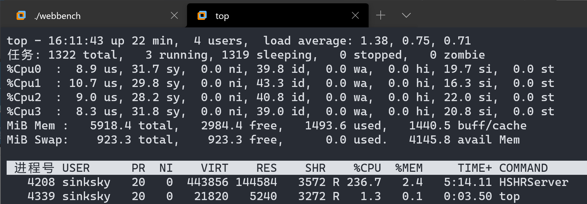

# HSHRServer

Linux下采用半同步/半反应堆(epoll)并发模型的多线程服务器(C++11/14)(功能上目前仅支持HTTP1.1 GET请求)

## 🤔Model


- 事件循环: Eventloop运行在主线程中,检查各种读写就绪事件,同时维护各种文件描述符.文件描述符大致可分为三类,Listenfd(服务器监听套接字),Pipefd(统一事件源),Connfd(客户端连接套接字).
- 定时器: TimerManage统一管理Timer,使用了STL中的priority queue来实现,在主线程中通过SIGALRM信号来驱动.
- 同步队列: 使用C++11 mutex condition_variable实现(推模型).
- 线程池: 将同步队列中就绪的Connfd分发给其他线程处理.(Threadpool中包含了同步队列)
- HTTP相关:ReadBuf(读入数据),ProcessRead(解析数据,状态转移),ProcessWrite(根据状态确定要发送的数据),WriteBuf(写出数据).http相关数据保存在Httpdata中,http相关操作保存在Httpprocess中.

## ✨Highlight

- C++11/14风格代码(命名空间,闭包,枚举类,条件变量,线程,完美转发...)
- 良好的模块化设计,分离事件通知管理和事件处理机制,使用模板方便代码复用
- 使用智能指针管理资源所有权(区分所有与可使用)
- IO多路复用(Epoll边缘触发),非阻塞IO,Reactor事件处理模式
- 使用线程池充分利用多核CPU,避免频繁线程建立销毁开销
- 使用正则查找来解析HTTP请求,使用状态机来计算HTTP的状态变化
- 统一事件源,将信号纳入主线程统一的事件处理框架中,解决了signal handler可重入问题
- 支持半关闭连接,长连接,大文件传输,403 404状态处理

## 🔨Usage

使用Cmake构建项目

```bash
cmake . && make
```

用法

```bash
./HSHRServer <ip> <port>
```

## 📊WebBench

在 i7-8550U 上 Vmware 4核6G内存上使用WebBench测试

HTTP 1000客户端60秒短连接


HTTP 1000客户端60秒长连接




## 😅Thinking

- TimerManage和HttpProcess是模块分离的,那如何解决多线程下Connfd对于TimerManage和HttpProcess资源访问有效性的冲突?

> 可以使用shared_ptr使Eventloop和Threadpool同时持有Connfd,或unique_ptr在两者之间转移.但这里选择了更加语义化的做法,Eventloop管理着所有连接,是连接的所有者,Eventloop在事件就绪时会更新Timer,如果在3*TIMESLOT的时间内还不能完成一个事件请求(包括从队列中等待),那可能服务器处理这个请求的过程就存在一些问题.(但这导致服务器并不健壮......)而TimerManage只所有并使用Timer,HttpProcess将Timer的vaild标志设为false,即可.

**Update:** 这确实是个欠妥的设计,大文件传输超过15秒将会引起问题...现在的想法则是Eventloop提供一个同步队列,更新Timer同样是在主线程进行(更新Timer需要操作定时堆,多线程情况下需要加锁,导致主线程不能及时处理Listenfd),工作线程面对短连接直接关闭,将需要设置超时关闭的长连接信息放入消息队列,让主线程来完成对时间堆的操作.

## 🥰Thanks

服务器的代码实现参考了游双写的 [Linux高性能服务器编程](https://book.douban.com/subject/24722611//)

WebBench则使用了 [linyacool](https://github.com/linyacool) 修改的支持长连接测试的 [WebBench](https://github.com/linyacool/WebBench)

表示衷心的感谢